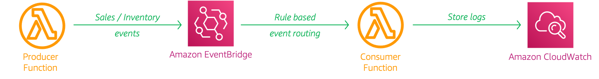

# Event Driven Architecture with EventBridge & Lambda

The developer at Mystique Unicorn are interested in building their application using event-driven architecture. For those who are unfamiliar, _An event-driven architecture uses events to trigger and communicate between decoupled services and is common in modern applications built with microservices. An event is a change in state, or an update, like an item being placed in a shopping cart on an e-commerce website._

In this application, they will have their physical stores, send _sales_ and _inventory_ related events to a central location, where multiple downstream systems will consume these events. For example, A event for a new order will be consumed by the dispatch and warehouse system independently. 

They heard that AWS offers capabilities on to build event-driven architectures. Can you help them?


## 🎯 Solutions

AWS offers multiple capabilities to perform event-driven architectures. Event-driven architectures have three key components: 
 - **Event Producers**
 - **Event Routers** 
 - **Event Consumers**. 
A producer publishes an event to the router, which filters and pushes the events to consumers. Producer services and consumer services are decoupled, which allows them to be scaled, updated, and deployed independently.

Let us assume each store produces an event like the one shown below,

```json
{
    "version": "0",
    "id": "d14dcbec-a626-b929-6d26-9b4a0babfdc2",
    "detail-type": "sales-events",
    "source": "Miztiik-Automation-Data-Producer",
    "account": "23004178",
    "time": "2021-03-06T17:15:06Z",
    "region": "us-east-1",
    "resources": [],
    "detail": {
        "request_id": "b4d727cc-2b00-4146-aee9-33097f33a6e2",
        "name": "Minotaur",
        "category": "Books",
        "store_id": "store_2",
        "sales": 75.32,
        "contact_me": "github.com/miztiik",
        "is_return": true
    }
}
```

The `detail-type` attribute is used to capture the type of event. Based on this attribute this message can be routed to the appropriate consumer. We will use a lambda to perform the producer and consumer actions. For the routing the events, we will use AWS EventBridge - `Event Bus` and `Event Rules` to receive and route messages. In this article, we will build an architecture, similar to the one shown below. We will start backwards so that all the dependencies are satisfied.




1.  ## 🧰 Prerequisites

    This demo, instructions, scripts and cloudformation template is designed to be run in `us-east-1`. With few modifications you can try it out in other regions as well(_Not covered here_).

    - 🛠 AWS CLI Installed & Configured - [Get help here](https://youtu.be/TPyyfmQte0U)
    - 🛠 AWS CDK Installed & Configured - [Get help here](https://www.youtube.com/watch?v=MKwxpszw0Rc)
    - 🛠 Python Packages, _Change the below commands to suit your OS, the following is written for amzn linux 2_
      - Python3 - `yum install -y python3`
      - Python Pip - `yum install -y python-pip`
      - Virtualenv - `pip3 install virtualenv`

1.  ## ⚙️ Setting up the environment

    - Get the application code

      ```bash
      git clone https://github.com/miztiik/event-driven-with-eventbridge
      cd event-driven-with-eventbridge
      ```

1.  ## 🚀 Prepare the dev environment to run AWS CDK

    We will use `cdk` to make our deployments easier. Lets go ahead and install the necessary components.

    ```bash
    # You should have npm pre-installed
    # If you DONT have cdk installed
    npm install -g aws-cdk

    # Make sure you in root directory
    python3 -m venv .venv
    source .venv/bin/activate
    pip3 install -r requirements.txt
    ```

    The very first time you deploy an AWS CDK app into an environment _(account/region)_, you’ll need to install a `bootstrap stack`, Otherwise just go ahead and deploy using `cdk deploy`.

    ```bash
    cdk bootstrap
    cdk ls
    # Follow on screen prompts
    ```

    You should see an output of the available stacks,

    ```bash
    event-driven-with-eventbridge-orders-eventbus-stack
    event-driven-with-eventbridge-orders-producer-stack
    event-driven-with-eventbridge-orders-consumer-stack
    ```

1.  ## 🚀 Deploying the application

    Let us walk through each of the stacks,

    - **Stack: event-driven-with-eventbridge-orders-eventbus-stack**

      This stack will create a EventBridge event bus that can receive events from producers.

      Initiate the deployment with the following command,

      ```bash
      cdk deploy event-driven-with-eventbridge-orders-eventbus-stack
      ```

      After successfully deploying the stack, Check the `Outputs` section of the stack. You will find the `StoreOrdersEventBus` event bus resource created for you.

    - **Stack: event-driven-with-eventbridge-orders-producer-stack**

      This stack will create the producer lambda function will generate a payload(_like the one shown above_) and sends them to the event bus created in the previous stack. This function is designed to produce two types of events `sales-events` and `inventory-events`. We will use this feature later to consume only one type of event in the consumer. By default the producer is configured to generate `5` events in total with a randomized mix of the two event types.

      Initiate the deployment with the following command,

      ```bash
      cdk deploy event-driven-with-eventbridge-orders-producer-stack
      ```

      After successfully deploying the stack, Check the `Outputs` section of the stack. You will find the `eventBridgeDataProducer` resource.

    - **Stack: event-driven-with-eventbridge-consumer-stack**

      This stack will create a event bridge rule that will be trigger the lambda function when ever it receives an event of `detail-type = sales-events`

      ```bash
      cdk deploy event-driven-with-eventbridge-consumer-stack
      ```

      After successfully deploying the stack, Check the `Outputs` section of the stack. You will find the `msgConsumer` resource.

1.  ## 🔬 Testing the solution

    1. **Invoke Producer Lambda**:
      Let us start by invoking the lambda- `eventBridgeDataProducer` from the producer stack using the AWS Console. If you want to ingest more events, invoke the lambda few times.
          ```json
          {
            "statusCode": 200,
            "body": "{\"message\": {\"status\": true, \"tot_msgs\": 5, \"bad_msgs\": 0, \"sale_evnts\": 1, \"inventory_evnts\": 4}}"
          }
          ```
        Here in this invocation, We have ingested about `5` messages. Within those message, we have `1` messages does not have `store_id` identified as `bad_msgs` and `1` event for sales and `4` events for inventory

    1. **Check Consumer Cloudwatch Logs**:

       After a couple of minutes, check the consumer cloudwatch logs. Usually the log name should be something like this, `/aws/lambda/events_consumer_fn`. Navigate to the log stream.

       You should be finding some successfully processed messages like this,
       ```json
        {
            "version": "0",
            "id": "bc36b7e4-b984-dde0-31ed-9f565413fe01",
            "detail-type": "sales-events",
            "source": "Miztiik-Automation-Data-Producer",
            "account": "23004178",
            "time": "2021-03-06T20:53:37Z",
            "region": "us-east-1",
            "resources": [],
            "detail": {
                "request_id": "b2070832-e4a3-4843-ac54-a3880e583688",
                "name": "Aarakocra",
                "category": "Mobiles",
                "store_id": "store_5",
                "sales": 29.9,
                "contact_me": "github.com/miztiik",
                "is_return": true
            }
        }
       ```

      You can observe that the only events with detail type `sales-events` are logged.


1.  ## 📒 Conclusion

    Here we have demonstrated how to use EventBridge for event driven architecture. You can extend this further by enriching the event rules by filtering them based on `sales` value or sending a event for a particular `category` to that supplier/vendor system.

1.  ## 🧹 CleanUp

    If you want to destroy all the resources created by the stack, Execute the below command to delete the stack, or _you can delete the stack from console as well_

    - Resources created during [Deploying The Application](#-deploying-the-application)
    - Delete CloudWatch Lambda LogGroups
    - _Any other custom resources, you have created for this demo_

    ```bash
    # Delete from cdk
    cdk destroy

    # Follow any on-screen prompts

    # Delete the CF Stack, If you used cloudformation to deploy the stack.
    aws cloudformation delete-stack \
      --stack-name "MiztiikAutomationStack" \
      --region "${AWS_REGION}"
    ```

    This is not an exhaustive list, please carry out other necessary steps as maybe applicable to your needs.

## 📌 Who is using this

This repository aims to show how to use EventBridge for event driven architecture to new developers, Solution Architects & Ops Engineers in AWS. Based on that knowledge these Udemy [course #1][102], [course #2][101] helps you build complete architecture in AWS.

### 💡 Help/Suggestions or 🐛 Bugs

Thank you for your interest in contributing to our project. Whether it is a bug report, new feature, correction, or additional documentation or solutions, we greatly value feedback and contributions from our community. [Start here](/issues)

### 👋 Buy me a coffee

[](https://ko-fi.com/Q5Q41QDGK) Buy me a [coffee ☕][900].

### 📚 References

1. [Docs: What is an Event-Driven Architecture?][1]


### 🏷️ Metadata


**Level**: 200

[1]: https://aws.amazon.com/event-driven-architecture/

[100]: https://www.udemy.com/course/aws-cloud-security/?referralCode=B7F1B6C78B45ADAF77A9
[101]: https://www.udemy.com/course/aws-cloud-security-proactive-way/?referralCode=71DC542AD4481309A441
[102]: https://www.udemy.com/course/aws-cloud-development-kit-from-beginner-to-professional/?referralCode=E15D7FB64E417C547579
[103]: https://www.udemy.com/course/aws-cloudformation-basics?referralCode=93AD3B1530BC871093D6
[899]: https://www.udemy.com/user/n-kumar/
[900]: https://ko-fi.com/miztiik
[901]: https://ko-fi.com/Q5Q41QDGK
